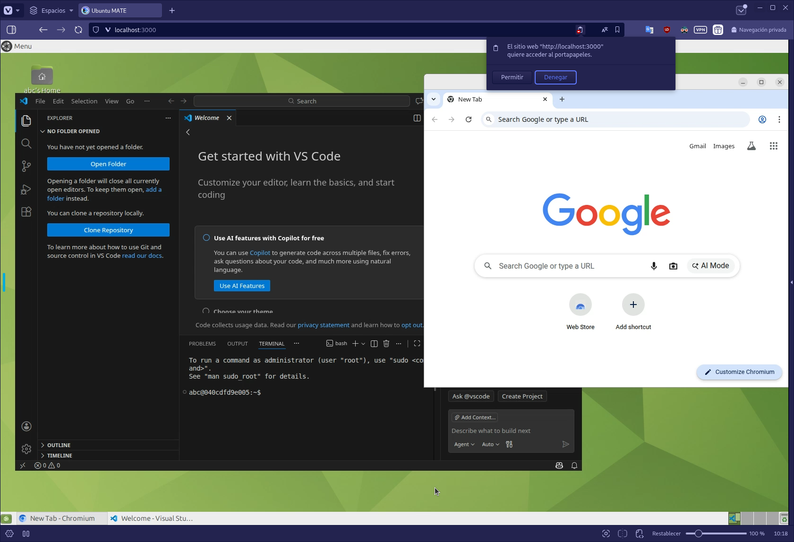

# Ubuntu Mate Desktop, accessible via navegador 

Escritorio completo servido bajo Docker sin necesidad de máquina virtual, X11 Forwarding, VNC, NX, etc.

Proyecto original: https://docs.linuxserver.io/images/docker-webtop/#supported-architectures

Traido al grupo de aprendizaje Bunker 4 por

- [Nahuel Palacio](https://github.com/PNahuel5588) - ver video en https://www.youtube.com/watch?v=ZHIgO-OL4xg
- Anibal Rivero (Sensar.nl)

Ideal para 

- Para acceder a recursos pesados de servidor remoto
- Brindar a alumnos un escritorio completo de trabajo, sin necesidad que instalen Linux en máquinas limitadas.

Relacionado: [más trucos para tener un escritorio liviano, remoto](https://github.com/perfeccion-ar/infraestructura-clasica-y-avanzada/wiki/Escritorios-livianos)

## Minimal instructions by Anibal

- Copy `env.example` to `.env`
- Edit the values in `.env`
- `docker compose up -d && docker compose logs -f`
- If you are inside a container, forward ports 3000 and 3001
- Access it with `https://${SERVER_NAME}:3001`

