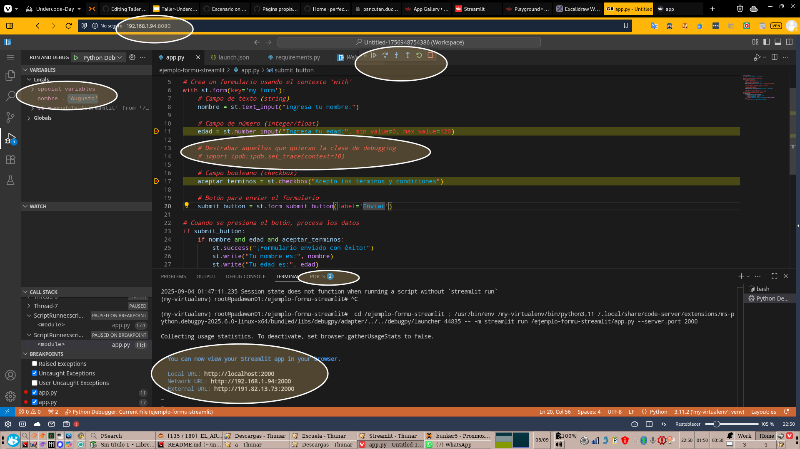

# Clase de Streamlit para Underc0de Day 2025

Incluye además del código, una linea con el debugger ipdb

Y ademas un .vscode/launch.json con las líneas correctas para lanzar también el cómodo debugger de Visual Code Editor

