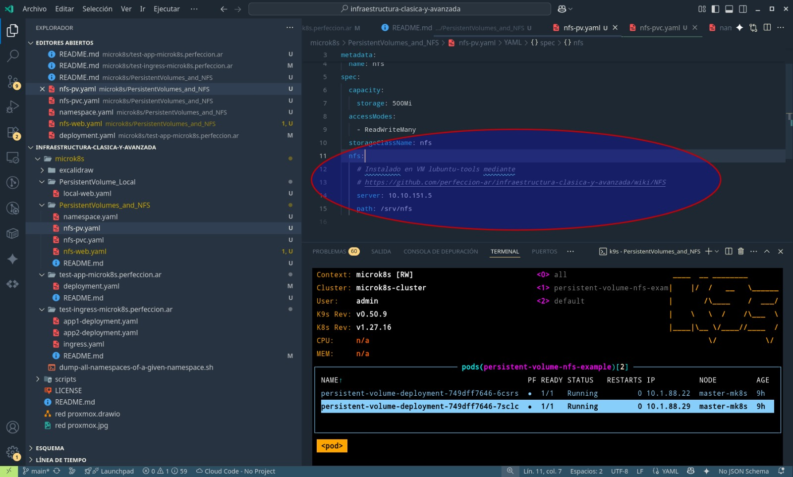

Ejemplo de volúmenes en Kubernetes, apuntando a un NFS en común

Fuentes:

- https://www.youtube.com/watch?v=pumX2Ds5L0c
- https://github.com/perfeccion-ar/infraestructura-clasica-y-avanzada/wiki/NFS
- https://github.com/perfeccion-ar/infraestructura-clasica-y-avanzada/wiki/Kubernetes
